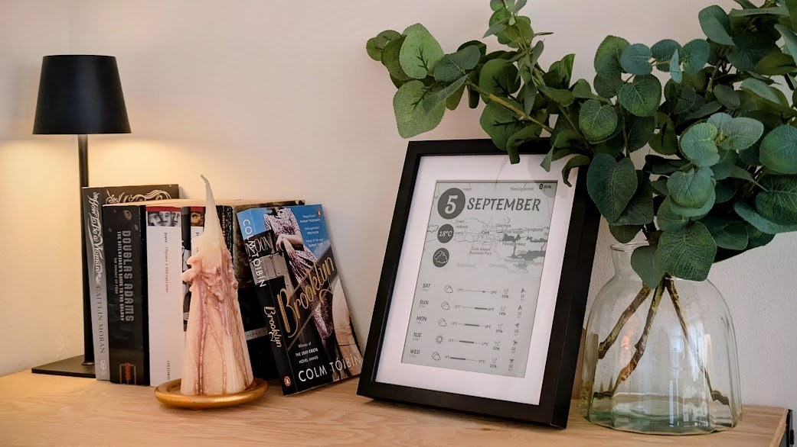
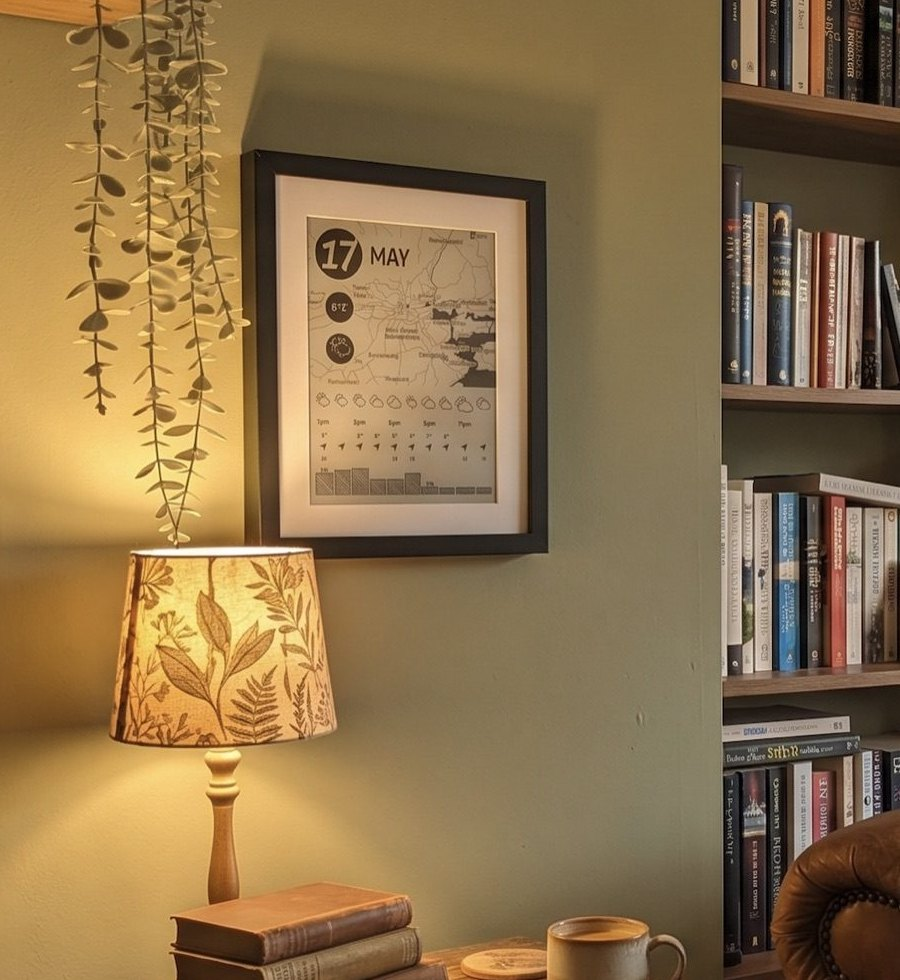

# epd — a library for showing web pages on an e-paper display

<p align="center">
  
</p>

Write a page in Python and HTML. A machine you keep on — a Raspberry Pi, a
NAS, an old laptop — renders it to an image. Your e-paper panel wakes,
fetches it, draws it, and sleeps again, for months, on one battery.

**Good for** a wall calendar · a weather board · train and bus times · a
family chore list · a photo frame · a sensor readout · anything you can
write as a web page.

The server is the brains of the pair:

- It builds the page and converts it to a PNG.
- It serves that PNG over HTTP, and tells the panel how long to sleep and
  which page to fetch next.
- It watches for new firmware releases and offers them to the panel, which
  takes one at its next wake.

epd is a library in two parts. They share one HTTP contract and version
together:

- **`server/`** — `epd_server`, a Python package. Run it on whatever machine
  you keep on.
- **`firmware/`** — `EpdClient`, a PlatformIO library for the ESP32 inside
  the panel. It knows one address and nothing else: no layout, no schedule,
  no timezone.

The panel driver is a library of its own — `firmware/boards/inkplate/` for
Inkplate panels. Any other e-paper board can bring its own: write an
[`IBoard`](docs/custom-board.md) for your hardware and everything above it
works unchanged.

## What you need

|  |  |
|---|---|
| **A panel** | An [Inkplate](https://soldered.com/categories/inkplate/) — 10, 6, 5 Gen2 or 2 — which is an e-paper screen with an ESP32 already attached. Other ESP32 e-paper boards work too; see [Other hardware](docs/custom-board.md). |
| **A computer that stays on** | A Raspberry Pi, a NAS, an old laptop. It runs the server. The panel needs to reach it over your home network each time it wakes. |
| **Python 3.11+ and Chromium** | The server draws your page with a real browser, so ordinary HTML and CSS work as they do everywhere else. |
| **[PlatformIO](https://platformio.org/install)** | To put the software on the panel. |
| **A USB cable** | For the first flash only. After that the panel updates itself over WiFi. |

Expect about 30 minutes to the first picture on the screen.

## Quickstart

You never run anything inside epd. Check it out beside your own project and
build against it — both halves of your display live in your project.

```sh
git clone https://github.com/chrisjtwomey/epd.git
mkdir -p my-display/src && cd my-display
```

You now have `epd/` and `my-display/` side by side. Everything below happens
in `my-display`.

### 1. Start a server

```sh
python3 -m venv .venv && source .venv/bin/activate
pip install ../epd/server
```

Save this as `server.py`. It is a whole server: one page showing the time,
shown at 08:00 and again at 20:00.

```python
from datetime import datetime
from zoneinfo import ZoneInfo

from epd_server import DisplayServer, Page, StaticSource

CSS = """
body { margin:0; height:100vh; display:flex; flex-direction:column;
       align-items:center; justify-content:center; font-family:Helvetica, sans-serif; }
.time { font-size:180px; font-weight:700; }
.date { font-size:48px; }
"""


class ClockPage(Page):
    def template(self):
        now = datetime.now()
        with self.airium.html():
            with self.airium.head():
                self.airium.style(_t=CSS)
            with self.airium.body():
                self.airium.div(klass="time", _t=now.strftime("%H:%M"))
                self.airium.div(klass="date", _t=now.strftime("%A %d %B"))


DisplayServer(
    pages=[ClockPage("clock", width=825, height=1200,
                     html_dir="build", png_dir="build")],
    source=StaticSource(),
    schedule=[("08:00:00", "clock.png"), ("20:00:00", "clock.png")],
    tz=ZoneInfo("Europe/Dublin"),
).run()
```

Make sure the server can find Chromium. On Debian or a Raspberry Pi:

```sh
sudo apt install chromium chromium-driver
```

On macOS, point it at the browser you already have:

```sh
export CHROME_BIN="/Applications/Google Chrome.app/Contents/MacOS/Google Chrome"
```

Then run it:

```sh
python3 server.py
```

Open <http://localhost:8080/clock.png> in a browser. That image is exactly
what the panel will show. Change the CSS, restart, and look again.

### 2. Find the server's address

The panel needs an address it can reach — not `localhost`, which means the
panel itself.

```sh
ipconfig getifaddr en0     # macOS
hostname -I                # Linux
```

Write down what it prints, for example `192.168.1.10`.

### 3. Build the panel software

Three more files, alongside the `server.py` you already have.

`platformio.ini` — which board, and which libraries:

```ini
[env:release]
platform = espressif32
framework = arduino
board = esp32dev
monitor_speed = 115200
lib_deps =
	symlink://../epd/firmware
	symlink://../epd/firmware/boards/inkplate
build_unflags = -DARDUINO_ESP32 -DARDUINO_ESP32_DEV
build_flags =
	-DARDUINO_INKPLATE10           ; or ARDUINO_INKPLATE6, ARDUINO_INKPLATE5V2…
	-DBOARD_HAS_PSRAM
	-DCLIENT_NAME='"my-display"'   ; how this panel introduces itself
	-DCLIENT_VERSION='"v1.0.0"'
	-DLOG_LEVEL=4
```

`src/defaults.cpp` — your settings. Put your own address, network name and
password in the first block; the rest can stay as it is:

```cpp
#include <stdint.h>

char serverURL[] = "http://192.168.1.10:8080/clock.png";
char wifiSSID[] = "your-network";
char wifiPass[] = "your-password";

int serverRetries = 3;
uint32_t serverDefaultRefreshSeconds = 3600;
int wifiRetries = 10;

char ntpHost[] = "pool.ntp.org";
char ntpTimezone[] = "Europe/Dublin";

bool mqttLoggerEnabled = false;
char mqttLoggerBroker[] = "localhost";
int mqttLoggerPort = 1883;
char mqttLoggerClientID[] = "my-display";
char mqttLoggerTopic[] = "mqtt/my-display";
int mqttLoggerRetries = 3;
```

`src/main.cpp` — one wake, from beginning to end:

```cpp
#include "InkplateBoard.h"
#include "sleep_utils.h"
#include "user_agent.h"
#include "wake.h"

static InkplateBoard inkplateBoard;
IBoard& board = inkplateBoard;      // the panel epd draws on

void setup() {
    startBoard(1);                  // 1 = portrait
    ClientConfig cfg = loadConfig();

    uint32_t sleepSeconds = cfg.defaultRefreshSeconds;
    if (connectNetwork(cfg) == ESP_OK) {
        PageFetch page = {};
        page.length = board.getWidth() * board.getHeight() * 8 + 100;
        const char* errMsg = nullptr;
        if (fetchPage(cfg.serverURL, clientUserAgent(board.deviceName()),
                      cfg.serverRetries, &page, &errMsg)) {
            drawPage(page, nullptr, cfg.serverRetries, nullptr, &errMsg);
            sleepSeconds = page.response.nextRefreshSeconds;   // the server decides
        }
    }
    sleep_for(sleepSeconds);
}

void loop() {}
```

Plug the panel in, turn its power switch on, and flash it:

```sh
pio run -t upload
pio device monitor -b 115200
```

The log shows it connect, fetch, draw, and sleep. The page appears on the
screen and stays there while the panel is asleep, because e-paper needs no
power to keep an image.

That is the whole loop. From here you change the server, not the panel.

## How it works

Each time the panel wakes it asks the server for a picture. The server
answers with the picture plus two facts: how many seconds to sleep, and
which address to ask for next time.

```
panel ──── GET /clock.png ────▶ server
      ◀─── the image, "sleep 7200s", "ask for daily.png next"
      (draws it, then sleeps)
```

A project on top of epd supplies three things:

1. **Which panel** — an Inkplate, or your own board.
2. **Which pages** — the HTML you want drawn.
3. **Which data** — where the content comes from: an API, a sensor, a file.

Everything else — waking on time, WiFi, retries when the network is
flaky, watching the battery, sleeping, showing an error on screen, updating
itself — is already written.

## Going further

| | |
|---|---|
| **[Configuration](docs/configuration.md)** | Every setting, the build flags, and reading settings from an SD card instead of compiling them in. |
| **[Updates over the air](docs/ota.md)** | Publish a new version and every panel takes it at its next wake. How a bad release is caught and undone by itself. |
| **[The HTTP contract](docs/protocol.md)** | The exact requests and headers, for debugging with `curl` or writing your own client. |
| **[Other hardware](docs/custom-board.md)** | Any e-paper board, by writing one class. The Inkplate one is about 230 lines. |
| **[Testing your own project](docs/testing.md)** | Run your panel's logic on your laptop, with no board attached. |
| **[Server reference](server/README.md)** | Pages, data sources, scheduling, image quantising, the config file. |

## Built on epd



[**inkplate10-weather-cal**](https://github.com/chrisjtwomey/inkplate10-weather-cal)
— a framed Inkplate 10 on a wall. Weather, forecast and calendar, on
battery, waking seven times a day.

[**inkplate5-env-monitor**](https://github.com/chrisjtwomey/inkplate5-env-monitor)
— a mains-powered Inkplate 5 Gen2 showing temperature, humidity and air
quality from its own sensors.

<br clear="right">

Using epd for something? Open a pull request and add it.

## License

MIT
