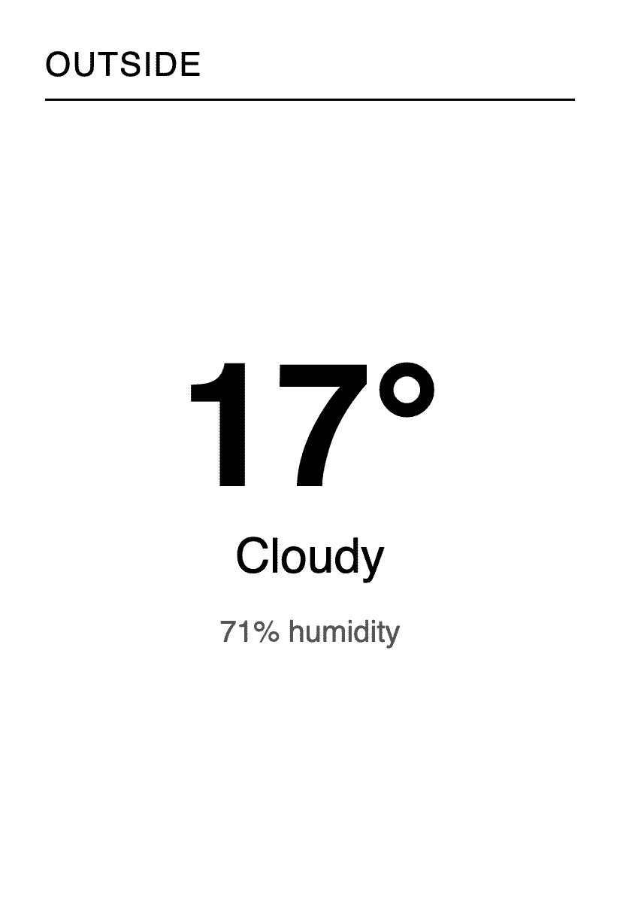
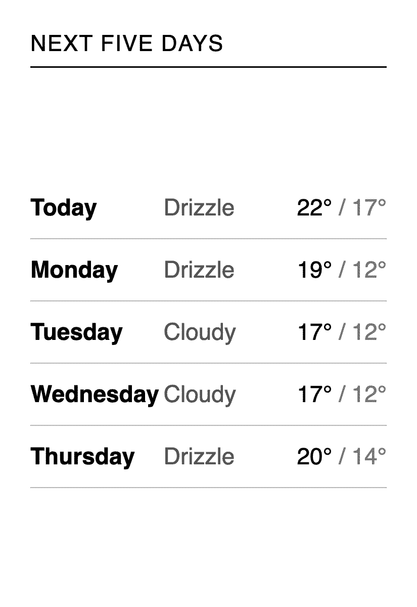

# live-data




[`minimal`](../minimal) draws a clock, which needs no data. This one draws
the weather, which needs all three of the things a real display uses:

- **A data source.** `weather.py` asks [Open-Meteo](https://open-meteo.com)
  for the forecast and offers it as two named datasets. No account and no
  key: a latitude and a longitude are the whole configuration.
- **A cache.** One response answers both datasets and is kept for fifteen
  minutes, so drawing both pages costs one call and a restart costs none.
- **Two pages on one schedule.** The current conditions through the day,
  the days ahead each evening.

The panel side is [`minimal`](../minimal)'s, unchanged. Point its
`cfg.serverURL` at `http://YOUR_SERVER_HOST:8080/now.png` and the server
sends it whichever page the schedule names next.

```
server.py     the pages, the source and the schedule, wired together
weather.py    the data source: one call, cached, two datasets
pages.py      the two pages, and what each needs
```

```sh
pip install ../../server && python3 server.py
```

Then open <http://localhost:8080/now.png> and
<http://localhost:8080/forecast.png>.

## How the three parts meet

A page names what it needs, and never fetches anything itself:

```python
class NowPage(Page):
    requires = ("conditions",)

    def template(self, **kwargs):
        now = kwargs["conditions"]
```

A source says what it has, as callables, so nothing is fetched until a page
that needs it is drawn:

```python
def datasets(self):
    return {"conditions": self.conditions, "outlook": self.outlook}
```

The server joins the two. Each dataset is fetched once per regeneration
however many pages asked for it, so the names are the only agreement
between a page and where its content comes from.

The schedule names a **pool**, not an image, and a pool of several images is
read in turn. Both pools here hold one image; give `outlook` a second and
the evening alternates between them.

## Somewhere else, or something else

Change `LATITUDE` and `LONGITUDE` in `server.py` and the display is about
somewhere else. Change `weather.py` and it is about something else
entirely: a source is any class with a `datasets()` method, so a train
timetable, a sensor on your desk or a file on disk all fit the same shape.
