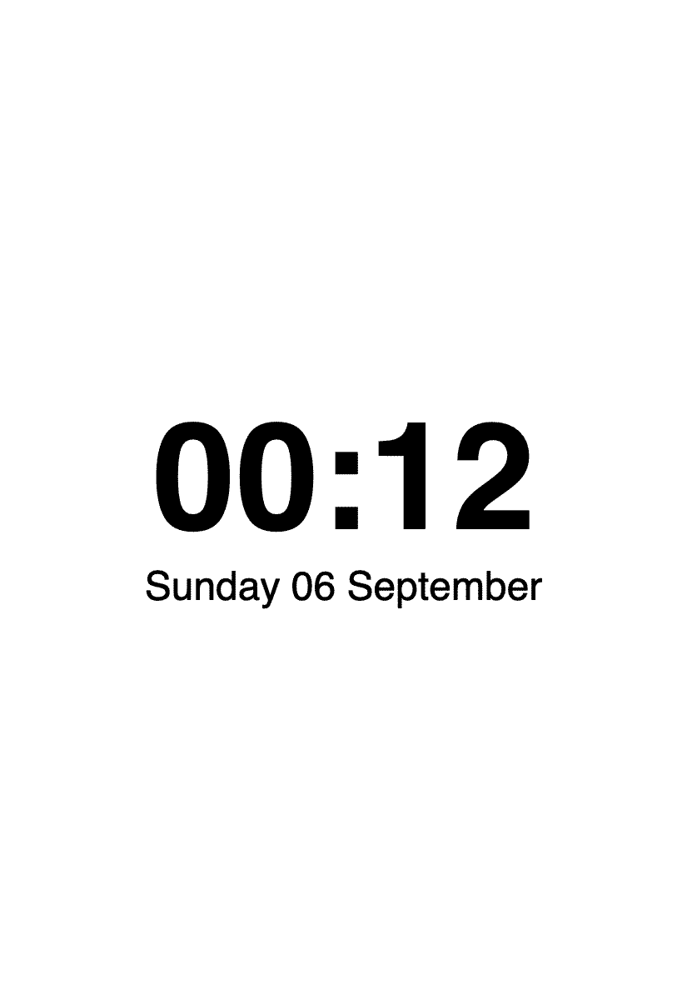

# minimal

The project the README's quickstart builds, ready to copy: one page showing
the time, and a panel that fetches it, draws it, and sleeps.



Four files, nothing else:

```
server.py            the page, and the server that renders and serves it
platformio.ini       which board, and where the epd libraries come from
src/defaults.cpp     your server address, network and password
src/main.cpp         one wake, from beginning to end
```

The two `lib_deps` point at `../../firmware`, this repository. Copy the
directory out and they become `../epd/firmware`, with epd checked out
beside it, as the quickstart describes.

```sh
pip install ../../server && python3 server.py    # the page, at :8080/clock.png
pio run -t upload                                # the panel
```

The picture on the right is `clock.png` as the server renders it: 825 × 1200,
the Inkplate 10 in portrait, in the four greys the panel can show.

See the [OTA example](../ota) for how the server sends a new version of the
panel's own software, which the panel takes at its next wake.
